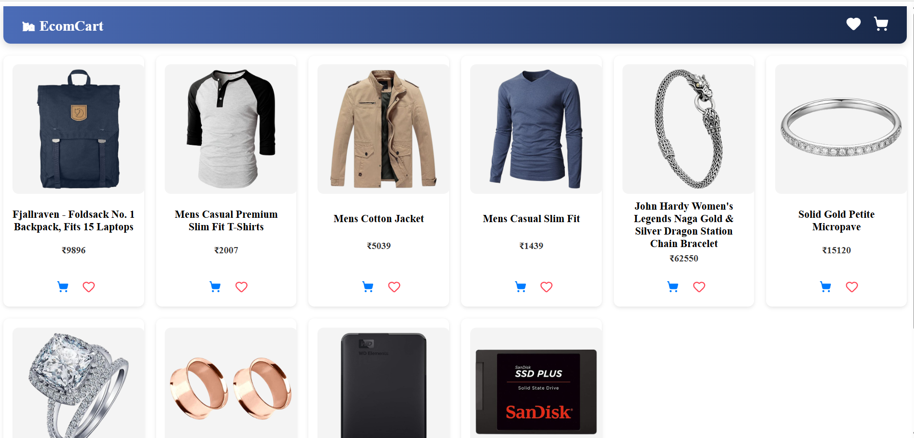
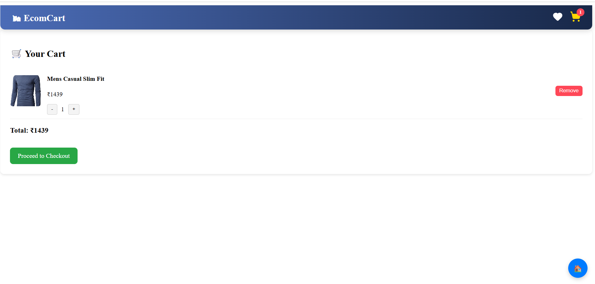
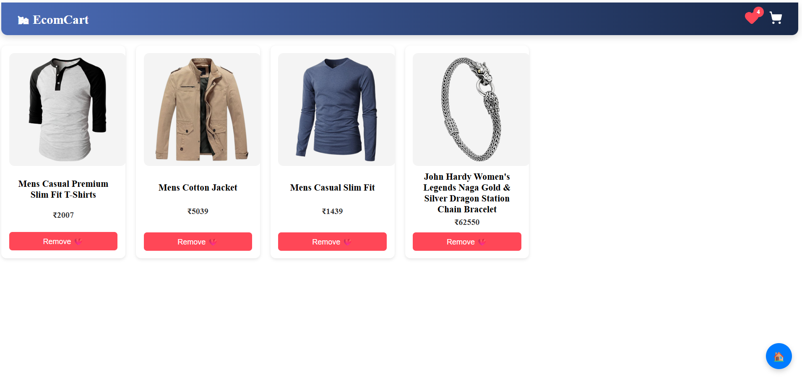
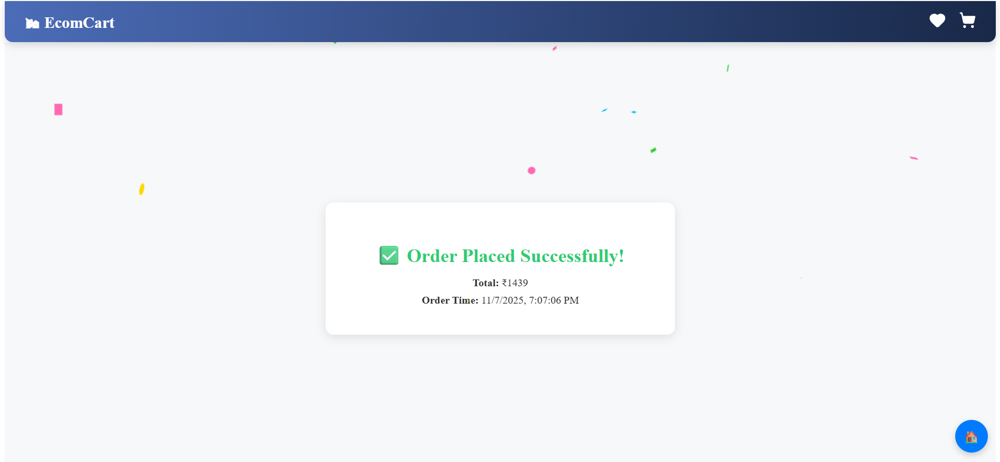

# 🛍️ EcomCart — Full Stack E-Commerce Cart App

A full-stack mock e-commerce cart built as part of the **E-Commerce Full Stack Assignment**.

This project demonstrates product listing, cart management, wishlist functionality, checkout, API integration, and database persistence.

---

## 🚀 Tech Stack

**Frontend:** React, React Router, Tailwind CSS  
**Backend:** Node.js, Express.js  
**Database:** MongoDB (Mongoose)  
**API Integration:** Fake Store API  
**Version Control:** Git & GitHub  

---

## ✨ Features

✅ Product listing with images, price, and “Add to Cart” button  
❤️ Wishlist (Like/Unlike products) with red heart icon  
🛒 Cart page with live quantity update, remove, and total price  
💳 Checkout form with name/email and mock receipt generation  
🔁 Data persistence using MongoDB (Cart + Wishlist remain after reload)  
⚡ Error handling and fallback if Fake Store API fails  
📱 Responsive UI for desktop and mobile  
🎉 Success modal with confetti animation  

---

## 📂 Folder Structure

```
├── backend/
│   ├── server.js
│   ├── routes/
│   ├── models/
│   └──config/
│
├── frontend/
│   ├── src/
│   ├── public/
│   │   └── screenshots/
│   └── package.json
│
├── .env.example
├── README.md
└── package.json
```

---

## ⚙️ Setup Instructions

### 1️⃣ Clone the repository
```bash
git clone https://github.com/YOUR_GITHUB_USERNAME/vibecart.git
cd vibecart
```

### 2️⃣ Backend setup
```bash
cd backend
npm install
```

Create a `.env` file in `/backend` (based on `.env.example`):
```
PORT=5000
MONGO_URI=your_mongo_connection_string
```

Start backend:
```bash
npm run dev
```

### 3️⃣ Frontend setup
```bash
cd ../frontend
npm install
npm start
```

---

## 🧠 API Endpoints

| Method | Endpoint | Description |
|--------|-----------|-------------|
| GET | `/api/products` | Get all products (from FakeStore or fallback) |
| GET | `/api/cart` | Get all items in cart |
| POST | `/api/cart` | Add item to cart |
| DELETE | `/api/cart/:id` | Remove item from cart |
| POST | `/api/checkout` | Mock checkout, returns receipt |

---

## 🖼️ Screenshots

### 🏠 Homepage


### 🛒 Cart Page


### ❤️ WishList Page


### ✅ Checkout Success


---

## 🎥 Demo Video

👉 Watch the project demo here: https://www.loom.com/share/14bb781e446646ec8488d81ee084a1df

---

## 💬 Developer

**Name:** Payal Khalage  
**Tech Stack:** MERN (MongoDB, Express, React, Node.js)  

---

## 🏁 Conclusion

This project fulfills all the requirements of the Full Stack E-Commerce assignment:
- API integration  
- Responsive UI  
- Mock checkout flow  
- Database persistence  
- Error handling  

Thank you for reviewing my submission! 💫
